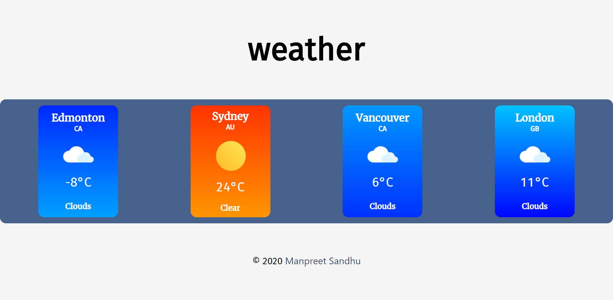

## My first react app. 

### A simple weather widget that displays the current temperature and weather condition for a city provided by user. Temperature below 12ºC is considered cool and above 12ºC is considered hot. The background color of the weather card changes according to the temperature.
---
React libraries used:
- [Framer Motion](https://www.framer.com/motion/) for animation
- [Emotion](https://emotion.sh/docs/styled) for styled components
- [React Reel](https://www.npmjs.com/package/react-reel) for the reel effect of temperature

A config.json file that contains an api key from OpenWeather is required in the src folder.  

format for the config.json file:  
`{ "apiKey": "**_your key here_**" }`

---

### App can be viewed live [here!](https://thor.net.nait.ca/~msandhu1/weather/)
